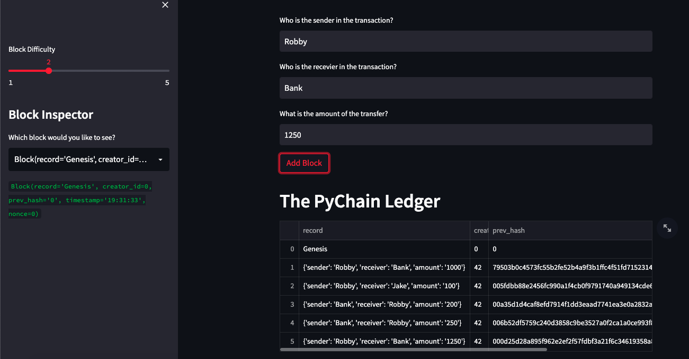

# Blockchain_Ledger
A ledger that uses blockchain to track and validate all transaction's senders, receivers, and amounts.

---

## Technologies

This application is written in Python v. 3.9.7 and is deployed using [Streamlit](https://docs.streamlit.io/). This application makes use of
the following libraries:


[pandas](https://pandas.pydata.org/docs/) was used for data collection, preparation, and analysis

[streamlit](https://docs.streamlit.io/) was used for deploying the application to a webpage

[dataclasses](https://docs.python.org/3/library/dataclasses.html) was used to create dataclasses

[typing](https://docs.python.org/3/library/typing.html) was used for runtime support

[datetime](https://docs.python.org/3/library/datetime.html) was used to work with data sets in datetime format

[hashlib](https://docs.python.org/3/library/hashlib.html) was used to create hashes of input data to keep data secure

---

## Installation Guide

Prior to running this application, perform the following in the command line to install the required libraries:

`pip install pandas`

`pip install streamlit`

`pip install dataclasses`

`pip install typing`

`pip install datetime`

`pip install hashlib`

---

## Usage

In order to launch the application, navigate to the Blockchain_Ledger folder that contains all of the code for this application, and then type into the command line:

```
streamlit run pychain.py
```

Once on the streamlit webpage that is deployed, the user can type in inputs for sender, receiver, and amount of a transaction and proceed to add them to the blockain. The chain can also be validated at anytime by pressing the validate button. Below is an example of entries having been added to the blockchain and of the chain being validated:




---

## Contributors

Robby Odum

Email: rodum012@gmail.com

---

## License

MIT